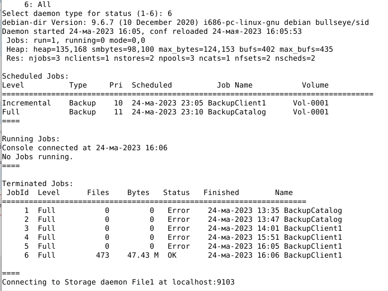

# Домашнее задание к занятию 10.4 «Резервное копирование»


### Инструкция по выполнению домашнего задания

1. Сделайте fork [репозитория c Шаблоном решения](https://github.com/netology-code/sys-pattern-homework) к себе в Github и переименуйте его по названию или номеру занятия, например, https://github.com/имя-вашего-репозитория/gitlab-hw или https://github.com/имя-вашего-репозитория/8-03-hw).
2. Выполните клонирование данного репозитория к себе на ПК с помощью команды `git clone`.
3. Выполните домашнее задание и заполните у себя локально этот файл README.md:
   - впишите вверху название занятия и вашу фамилию и имя
   - в каждом задании добавьте решение в требуемом виде (текст/код/скриншоты/ссылка)
   - для корректного добавления скриншотов воспользуйтесь инструкцией ["Как вставить скриншот в шаблон с решением"](https://github.com/netology-code/sys-pattern-homework/blob/main/screen-instruction.md)
   - при оформлении используйте возможности языка разметки md (коротко об этом можно посмотреть в [инструкции по MarkDown](https://github.com/netology-code/sys-pattern-homework/blob/main/md-instruction.md))
4. После завершения работы над домашним заданием сделайте коммит (`git commit -m "comment"`) и отправьте его на Github (`git push origin`);
5. Для проверки домашнего задания преподавателем в личном кабинете прикрепите и отправьте ссылку на решение в виде md-файла в вашем Github.
6. Любые вопросы по выполнению заданий спрашивайте в чате учебной группы и/или в разделе “Вопросы по заданию” в личном кабинете.

Желаем успехов в выполнении домашнего задания!

---

### Задание 1

В чём разница между:

- полным резервным копированием,
- дифференциальным резервным копированием,
- инкрементным резервным копированием.

*Приведите ответ в свободной форме.*

Основная разница между полным, дифференциальным и инкрементным резервным копированием заключается в том, какие данные копируются и как часто это происходит.
- Полное резервное копирование копирует все данные на компьютере или сервере и выполняется обычно один раз в неделю или месяц.
- Дифференциальное резервное копирование копирует только те данные, которые были изменены или добавлены после последнего полного резервного копирования и выполняется обычно каждый день или несколько раз в неделю.
- Инкрементное резервное копирование копирует только те данные, которые были изменены или добавлены с момента последнего резервного копирования (будь то полное или инкрементное) и выполняется обычно каждый день или даже несколько раз в день.

Полное резервное копирование занимает больше места на диске и занимает больше времени для выполнения, но обеспечивает наиболее полную защиту данных. Дифференциальное и инкрементное резервное копирование занимают меньше места на диске и выполняются быстрее, но требуют большего усилия при восстановлении данных.

---

### Задание 2

Установите программное обеспечении Bacula, настройте bacula-dir, bacula-sd,  bacula-fd. Протестируйте работу сервисов.

*Пришлите:*   
*- конфигурационные файлы для bacula-dir, bacula-sd,  bacula-fd,*   
*- скриншот, подтверждающий успешное прохождение резервного копирования.*


[bacula-dir.conf](/conf/bacula-dir.conf)

[bacula-fd.conf](/conf/bacula-fd.conf)

[bacula-sd.conf](/conf/bacula-sd.conf)




---

### Задание 3

Установите программное обеспечении Rsync. Настройте синхронизацию на двух нодах. Протестируйте работу сервиса.

*Пришлите рабочую конфигурацию сервера и клиента Rsync блоком кода в вашем md-файле.*
```
sudo apt install rsync
sudo nano /etc/default/rsync # RSYNC_ENABLE=true
sudo nano /etc/rsyncd.conf # Содержимое файла ниже в блоке кода
sudo systemctl start rsync.service
sudo systemctl status rsync.service
sudo netstat -tulnp |grep rsync # Проверяем работу rsync по сети
sudo nano /etc/rsyncd.scrt # backup:12345
sudo chmod 0600 /etc/rsyncd.scrt
# На второй ноде
sudo mkdir /root/scripts
sudo nano /root/scripts/backup-node1.sh # Содержимое файла-скрипта ниже в блоке кода
chmod 0744 /root/scripts/backup-node1.sh
sudo nano /etc/rsyncd.scrt # 12345
sudo chmod 0600 /etc/rsyncd.scrt
/root/scripts/backup-node1.sh # Тестируем синхронизацию
```

Файл rsyncd.conf :
```
pid file = /var/run/rsyncd.pid
log file = /var/log/rsyncd.log
transfer logging = true
munge symlinks = yes
# папка источник для бэкапа
[data]
path = /root/
uid = root
read only = yes
list = yes
comment = Data backup Dir
auth users = backup
secrets file = /etc/rsyncd.scrt
```

Файл backup-node1.sh :
```
#!/bin/bash
date
# Папка, куда будем складывать архивы — ее либо сразу создать либо не создавать а положить в уже существующие
syst_dir=/backup/
# Имя сервера, который архивируем
srv_name=node1 #из тестовой конфигурации
# Адрес сервера, который архивируем
srv_ip=10.128.0.29
# Пользователь rsync на сервере, который архивируем
srv_user=backup
# Ресурс на сервере для бэкапа
srv_dir=data
echo "Start backup ${srv_name}"
# Создаем папку для инкрементных бэкапов
mkdir -p ${syst_dir}${srv_name}/increment/
/usr/bin/rsync -avz --progress --delete --password-file=/etc/rsyncd.scrt ${srv_user}@${srv_ip}::${srv_dir} ${syst_dir}${srv_name}/current/ --backup --backup-dir=${syst_dir}${srv_name}/increment/`date +%Y-%m-%d`/
/usr/bin/find ${syst_dir}${srv_name}/increment/ -maxdepth 1 -type d -mtime +30 -exec rm -rf {} \;
date
echo "Finish backup ${srv_name}"
```


---
